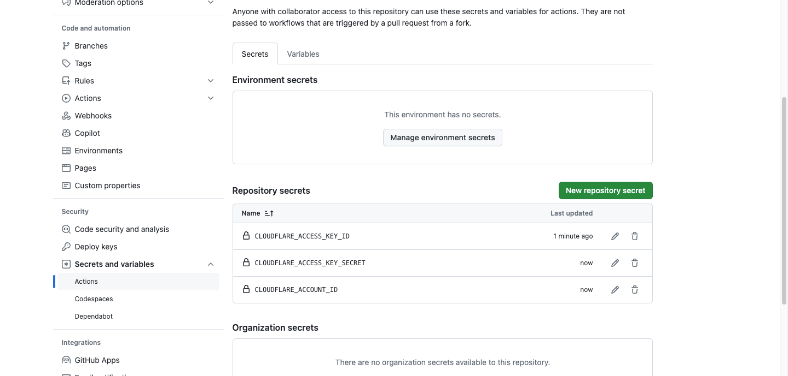

## Overview

A small wrapper to download data using cve2stix and cpe2stix, organising it into STIX bundles based on time ranges.

## Before you get started

If you do not want to backfill, maintain, or support your own CVE and CPE STIX objects check out CTI Butler which provides a fully manage database of these objects and more!

https://www.ctibutler.com/

## Install the script

```shell
# clone the latest code
git clone https://github.com/muchdogesec/cxe2stix_helper -b main --recurse-submodules
# create a venv
cd cxe2stix_helper
python3 -m venv cxe2stix_helper-venv
source cxe2stix_helper-venv/bin/activate
# install requirements
pip3 install -r requirements.txt
```

## Setup configoration options

You will need to create an `.env` file as follows;

```shell
cp .env.example .env
```

You will need to set your NVD API key. You can get on for free here: https://nvd.nist.gov/developers/request-an-api-key

## Usage

```shell
python3 cxe2stix_helper.py \
	--run_cve2stix boolean \
	--run_cpe2stix boolean \
	--last_modified_earliest date \
	--last_modified_latest date \
	--file_time_range dictionary
```

Where;

* `run_cve2stix` (optional, boolean): will run the cve2stix script with settings defined
	* default: `false`
* `run_cpe2stix` (optional, boolean): will run the cpe2stix script with settings defined
	* default: `false`
* `last_modified_earliest` (required, date in format `YYYY-MM-DDThh:mm:ss`): used in the the cve2stix/cpe2stix config
	* default: none
* `last_modified_latest` (required, date in format `YYYY-MM-DDThh:mm:ss`): used in the the cve2stix/cpe2stix config
	* default: none
* `file_time_range` (optional): defines how much data should be packed in each output bundle. Use `d` for days, `m` for months, `y` for years. Note, if no results are found for a time period, a bundle will not be generated. This usually explains why you see "missing" bundles for a day or month. 
	* default `1m` (1 month)

Both scripts also use the following parameters that a user does not enter at the command line

* `RESULTS_PER_PAGE=` parameter. The value of these is different between scripts. It is set in the `.env` file (but we don't recommend changing the defaults).
* `NVD_API_KEY=` parameter. A user should set this value in a local `.env` file in the base of the cxe2stix_helper code. This API key can be obtained for free here: https://nvd.nist.gov/developers/start-here . Note, the scripts will work without it, but it is very likely you will run into rate limit errors, so this is HIGHLY recommended.

### Example 1: Get 3 months of CPE data (split into STIX bundles of 1 month)

```shell
python3 cxe2stix_helper.py \
	--run_cpe2stix \
	--last_modified_earliest 2023-03-04T00:00:00 \
	--last_modified_latest 2023-06-04T23:59:59 \
	--file_time_range 1m
```

Will generate 4 bundle files in directories as follows:

```txt
output
└── bundles
	└── cpe
		└── 2023
			├── cpe-bundle-2023_03_04-2023_03_31.json
			├── cpe-bundle-2023_04_01-2023_04_30.json
			├── cpe-bundle-2023_05_01-2023_05_31.json
			└── cpe-bundle-2023_06_01-2023_06_04.json
```

### Example 2: Get 3 days of CVE data (split into STIX bundles of 1 day)

```shell
python3 cxe2stix_helper.py \
	--run_cve2stix \
	--last_modified_earliest 2023-01-01T00:00:00 \
	--last_modified_latest 2023-01-03T23:59:59 \
	--file_time_range 1d
```

Will generate 3 bundle files:

* `cve-bundle-2023_01_01-2023_01_01.json`
* `cve-bundle-2023_01_02-2023_01_02.json`
* `cve-bundle-2023_01_03-2023_01_03.json`

```txt
output
└── bundles
	└── cve
		└── 2023
			├── cve-bundle-2023_01_01-2023_01_01.json
			├── cve-bundle-2023_01_02-2023_01_02.json
			└── cve-bundle-2023_01_03-2023_01_03.json
```

### Example 3: Get 2 days of CVE and CPE data (split into STIX bundles of 2 months)

```shell
python3 cxe2stix_helper.py \
	--run_cve2stix \
	--run_cpe2stix \
	--last_modified_earliest 2023-01-01T00:00:00 \
	--last_modified_latest 2023-01-02T23:59:59 \
	--file_time_range 2m
```

Will generate 2 bundle files:

```txt
output
└── bundles
 	├── cve
	│ 	└── 2023
	│ 		└── cve-bundle-2023_01_01-2023_01_02.json
	└── cpe
	  	└── 2023
	  		└── cpe-bundle-2023_01_01-2023_01_02.json
```

## Why not run the scripts (cpe2stix / cve2stix) independently?

The APIs can return a large amount of data, and downloading large time ranges in one run can cause an issue.

We use a range of downstream tools that require STIX bundles in smaller sizes and with certain naming conventions.

Which means you need to manually edit the .env files for many time ranges each time.

cxe2stix_helper is designed to automate the process of downloading very large datasets whilst also allowing control on the output filenames.

If you want to keep a copy of each individual STIX .json object, you should use cve2stix or cpe2stix. cxe2stix_helper will only print the final bundles.

## Recommendations for running large backfills

### CVE

The first CVE published was `1988-10-01T04:00:00.000`. There are 250,888 at the time of writing, and this number increasing rapidly.

Due to the volume and size of CVEs, we recommend iterating through the data in days. This means all bundles (especially those after 2018) will always be less than 10mb.

Here is what we use;

```shell
python3 cxe2stix_helper.py \
	--run_cve2stix \
	--last_modified_earliest 2005-01-01T00:00:00 \
	--last_modified_latest 2024-01-01T23:59:59 \
	--file_time_range 1d
``` 

Note, whilst the first CVE was published in October 1988, it appears all CVEs published before 2005 were updated at the end of 2005 (or afterwards). The 

Thus, the earliest CVEs have a last modified date in 2005.

### CPE

There are more CPEs (1,267,211 currently) than CVEs but the STIX objects created from them are smaller, and thus a smaller file size.

Chunking the time range into 3 month periods will always deliver bundles less than 100mb.

```shell
python3 cxe2stix_helper.py \
	--run_cpe2stix \
	--last_modified_earliest 2007-01-01T00:00:00 \
	--last_modified_latest 2024-01-01T23:59:59 \
	--file_time_range 1d
```

The earliest CPEs have a last modified date in 2007.

## Git submodule use

We try and keep this repo in sync with the remote cve2stix / cpe2stix repos used as Git submodules when changes happen.

Sometimes this is not always the case (either because we've forgot, or there are breaking changes).

If it's the case we've forgotten, you can update the Git Submodules in this repo as follows:

```shell
cd cpe2stix
git checkout main
git pull
cd ..
cd cve2stix
git checkout main
git pull
```

## Support for Cloudflare R2 + Github action

We use a Github action to run this script daily to store the bundles generated by cxe2stix_helper on Cloudflare R2.

The script runs at 0700 UTC everyday (github servers UTC) using cron:  `"0 7 * * *"`

You can see the action in: `/.github/workflows/daily-r2.yml`.

Essentially the following command is run everyday by the action

```shell
python3 cxe2stix_helper.py \
	--run_cve2stix \
	--run_cpe2stix \
	--last_modified_earliest "YESTERDAY (00:00:00)" \
	--last_modified_latest "YESTERDAY (23:59:59)" \
	--file_time_range 1d
```

The action will store the data in the bucket as follows;

```txt
cxe2stix-helper-github-action-output
├── cve
│ 	└── 2023
│  		└── cve-bundle-2023_01_01-2023_01_02.json
└── cpe
	  └── 2023
	  	└── cpe-bundle-2023_01_01-2023_01_02.json
```

If you'd like to run the action in your own repository to create your own data store you will need to do the following;

### Create Cloudflare bucket/kets

First, go to Cloudflare.com and navigate to R2. Create a new bucket called `cxe2stix-helper-github-action-output`.

Now you need to create a CloudFlare API keys. For the CloudFlare API Key you create, make sure to set the permissions to `Admin Read & Write`. For security, it is also worth limiting the scope of the key to the bucket `cxe2stix_helper-github-action-output` (defined in the action).

### Set Github vars

Then go to the Github repo, then `repo > settings > secrets and variables > actions > new repository secret`.



Then choose one of the following options;

#### Option 1: use `CLOUDFLARE_*` vars

Set the following in the secrets;

```txt
CLOUDFLARE_ACCOUNT_ID=#Get this in Cloudflare R2 UI
CLOUDFLARE_ACCESS_KEY_ID=#Get this in Cloudflare R2 UI
CLOUDFLARE_ACCESS_KEY_SECRET=#Get this in Cloudflare R2 UI
NVD_API_KEY=#Get this from https://nvd.nist.gov/developers/request-an-api-key
```

You most likely want to use this approach.

#### Option 2: use `RCLONE_CONFIG` var

In the `RCLONE_CONFIG` var, add a valid RClone conf file (title must be `[R2]`), e.g.

```
[r2]
type = s3
provider = Cloudflare
access_key_id = <ACCESS_KEY>
secret_access_key = <SECRET_ACCESS_KEY>
region = auto
endpoint = https://<ACCOUNT_ID>.r2.cloudflarestorage.com
acl = private
```

This approach allows you to potentially use other services than just Cloudflare, if you know what you're doing.

Where:

* `[r2]`: A custom name(an alias) for storage service. We need to use it to operate files.
* `type` = s3: The type of file operation API. R2 supports the S3 standard protocol.
* `provider` = Cloudflare: The storage provider ID. You could use man rclone in your terminal to get the supported providers.
* `access_key_id`: You need to create a token with Admin Read & Write permissions on the R2 console (note, I am not sure if this is a bug, but I couldn’t get it to work with any other permissions levels)
* `secret_access_key`: Same as above.
* `endpoint`: The URL that rclone uses to operate files. To get the account id on the top-right of the R2 homepage.

### Backfill advicde

Due to the backfill size it will cause timeouts if you try to run it on Github. Similarly, if you set the `file_time_range` above `1d` it is likely to timeout due to data sizes. It's better to run the backfill locally and then start the automated action to backfill from backfill dayN+1.

## Support

[Minimal support provided via the DOGESEC community](https://community.dogesec.com/).

## License

[Apache 2.0](/LICENSE).